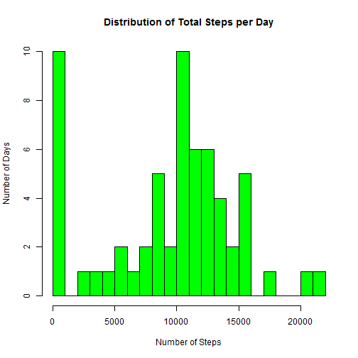
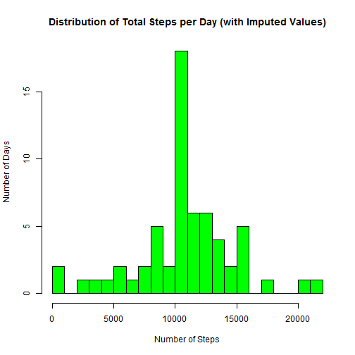

##Part 1: Loading and preprocessing the data

Use read.csv function to read the data file.


```r
library(timeDate)
setwd("C:/Users/Andrea/Coursera/05_Reproducible Research/Assignments")
data<-read.csv("repdata-data-activity/activity.csv")
```
  
##Part 2: Mean and Median and Steps per Day
A pedometer is able to track how many steps are taken by the wearer in 5 minute interval. But, the wearer is probably more interested in their daily total steps. Furthermore, they may wish to see what a 'normal' day looks like by examining the mean and median across all the days they wore the device.
  

```r
daily_split <- split(data, as.factor(data$date)) ## Split data based on calendar days

daily_total <- sapply(daily_split, function(x) sum(x$steps, na.rm=TRUE)) ##Find the sum of steps for each calendar day ignoring NAs

mean_daily_steps <- mean(daily_total)
median_daily_steps <- median(daily_total)
```
  
The mean number of daily steps is 9354.2295082.  
The median number of daily steps is 10395.  
  
A histogram is a better way to visualize the distribution.
  

```r
hist(daily_total, breaks = 20, col = "green", main = "Distribution of Total Steps per Day", xlab = "Number of Steps", ylab = "Number of Days")
```


  
##Part 3: Average Daily Activity Pattern
 
The pedometer wearer now wants to know which part of the day they are the most active...on average. To figure this out they need to know the average steps in each interval of the day.


```r
interval_split <- split(data, as.factor(data$interval))

interval_average <- sapply(interval_split, function(x) mean(x$steps, na.rm=TRUE))
interval_average2 <- as.matrix(interval_average)
x<- as.numeric(rownames(interval_average2))
y<-as.numeric(interval_average2[,1])

plot(x,y, type="l", main = "Average Steps per 5-Minute Interval", xlab = "Time Interval", ylab = 'Average Number of Steps', col = "green")
```


  
That's interesting. Now the pedometer wearer wants to know during which 5-minute segment they are typically the most active?


```r
most_active_interval <- rownames(interval_average2)[interval_average2==max(interval_average2)]
max_interval <- max(interval_average2)
```

They are the most active during interval 835 in which they average 206.1698113 steps.

  
##Part 4: Imputing Missing Values

Sometimes its hard to remember to wear your pedometer, and sometimes the battery goes dead while you are wearing it. That can lead to a lot of intervals without any steps recorded. I wonder how many intervals are missing data?


```r
na_rows <- sum(is.na(data$steps))
```

Wow! We have 2304 rows of missing data.

Maybe there is a way to fill in some of this data?

I think the best approach is to use the average steps for the same interval on all the other days.

That would mean filling in the average value shown in the line chart from Part 3 in place of any missing data.

Let's get started.

First, I take the vector containing the average for each of the 288, 5-minute interval and replicate it to be the same length as the data set. Then I column bind it to the original data set. Now the fourth column is showing the average steps in the interval.


```r
interval_average_lookup <- rep(interval_average, length.out = nrow(data))

data_B <- cbind(data, interval_average_lookup)

head(data_B)
```

```
##   steps       date interval interval_average_lookup
## 1    NA 2012-10-01        0               1.7169811
## 2    NA 2012-10-01        5               0.3396226
## 3    NA 2012-10-01       10               0.1320755
## 4    NA 2012-10-01       15               0.1509434
## 5    NA 2012-10-01       20               0.0754717
## 6    NA 2012-10-01       25               2.0943396
```

Now I'm going to create a fifth column in the data set which will copy the non-NA values from the steps column and replace any NA values with the lookup value in column 4. I do this by writing a function which will loop through every row and check if the steps value is NA. If no, it fills in a new blank vector with the steps value from column 1 otherwise it fills in the rows with the average steps value from column 4.

Once completed looping, the new column is bound to the original data set resulting ina 5-column data frame.


```r
loop_impute <- function (x) {
        mixed <- vector(mode="numeric")
        for (i in 1:nrow(x)) {
        if (is.na(x[i,1]) ==TRUE){
                mixed <- rbind(mixed,x[i,4])
        }        
                else mixed <- rbind(mixed,x[i,1])
        }
        mixed
}

combined <- loop_impute(data_B)

data_C <- cbind(data_B, combined)

head(data_C)
```

```
##   steps       date interval interval_average_lookup  combined
## 1    NA 2012-10-01        0               1.7169811 1.7169811
## 2    NA 2012-10-01        5               0.3396226 0.3396226
## 3    NA 2012-10-01       10               0.1320755 0.1320755
## 4    NA 2012-10-01       15               0.1509434 0.1509434
## 5    NA 2012-10-01       20               0.0754717 0.0754717
## 6    NA 2012-10-01       25               2.0943396 2.0943396
```

###Histogram and Summary Statistics after Imputing Values


```r
daily_split_I <- split(data_C, as.factor(data_C$date)) ## Split data based on calendar days

daily_total_I <- sapply(daily_split_I, function(x) sum(x$combined, na.rm=TRUE)) ##Find the sum of steps for each calendar day using the combined steps column

mean_daily_steps_I <- mean(daily_total_I)
median_daily_steps_I <- median(daily_total_I)
```
  
The mean number of daily steps is 1.0766189 &times; 10<sup>4</sup>.  
The median number of daily steps is 1.0766189 &times; 10<sup>4</sup>.  
  
A histogram is a better way to visualize the distribution.
  

```r
hist(daily_total_I, breaks = 20, col = "green", main = "Distribution of Total Steps per Day (with Imputed Values)", xlab = "Number of Steps", ylab = "Number of Days")
```


  
Imputing the missing values has caused the mean and the median of steps per day to increase.

The mean steps per day increased from 9354.2295082 to 1.0766189 &times; 10<sup>4</sup>.  
The median steps per day increased from 10395 to 1.0766189 &times; 10<sup>4</sup>.

##Part 5 Difference in Activity Patterns Between Weekdays and Weekends

To explore whether activity patterms vary between weekends and weekdays, we first need to identify in the data set which dates correspond to a weekday (M,T,W,Th,F) and which dates correspond to a weekend (Sa, Su).


```r
data_C$date_column <- as.Date(data_C$date, format="%Y-%m-%d")
data_C$DOW <- weekdays(data_C$date_column)
data_C$weekend<-isWeekend(data_C$date_column)
data_C$weekend <- factor(data_C$weekend, labels =c("Weekend","Weekday"))
```

Need to calculate the average steps in each interval separately for weekends and weekdays and graph the results.

We do that by splitting the data set on the Weekend/Weekday factor and the nterval factor and computing the mean for each interval.


```r
interval_split_C <- split(data_C, list(as.factor(data_C$interval),data_C$weekend))
interval_average_C <- sapply(interval_split_C, function(x) mean(x$steps, na.rm=TRUE))

par(fin=c(4,8))
par(mfrow=c(2,1))
plot(x,interval_average_C[1:288], type="l", main = "Weekends", xlab = "Time Interval", ylab = 'Ave. Steps', col = "purple")
plot(x,interval_average_C[289:576], type="l", main = "Weekdays", xlab = "Time Interval", ylab = 'Ave. Steps', col = "blue")
```


That's it.

Hope you liked it.

Andrea
